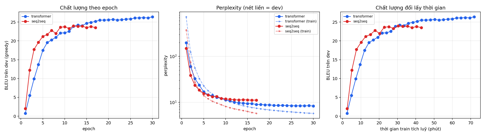

# So sánh Transformer và Seq2Seq + Attention cho dịch máy Anh–Việt trên IWSLT'15

**Lê Hoàng Quân** — MSV 24022433

Mã nguồn: https://github.com/quanai06/machine_translate

---

## Tóm tắt

Báo cáo trình bày việc cài đặt lại hai kiến trúc dịch máy nơ-ron và so sánh
chúng trên cùng bộ ngữ liệu song ngữ Anh–Việt IWSLT'15. Case 1 là Transformer
encoder-decoder theo Vaswani và cộng sự [1]. Case 2 là seq2seq LSTM kèm cơ chế
attention của Luong và cộng sự [3], tức kiến trúc nền tảng của bộ mã nguồn
`tensorflow/nmt` [13]. Cả hai được cài đặt bằng PyTorch, dùng chung bộ tokenizer,
chung cách chia batch và chung công thức tính BLEU, nhằm bảo đảm chênh lệch quan
sát được phản ánh kiến trúc chứ không phản ánh kỹ thuật huấn luyện.

Trên tập kiểm thử tst2013, Transformer đạt 30.35 BLEU với beam search, Seq2Seq
đạt 27.81 BLEU. Cả hai đều vượt các mốc đã công bố trên cùng tập dữ liệu: 23.3
BLEU của Luong và Manning [4] và 26.1 BLEU của `tensorflow/nmt` [13].

---

## 1. Mô tả hai trường hợp nghiên cứu

### 1.1. Bài toán và dữ liệu

Bài toán là dịch tự động từ tiếng Anh sang tiếng Việt ở miền phụ đề hội thoại
TED Talks. Ngữ liệu sử dụng là IWSLT'15 English-Vietnamese, phát hành kèm công
trình của Luong và Manning [4]. Đây là bộ dữ liệu chuẩn cho cặp ngôn ngữ này,
được hầu hết các nghiên cứu sau đó dùng làm mốc đối chiếu.

| Tập | Tệp | Số câu |
|---|---|---|
| Huấn luyện | `train.{en,vi}` | 133.317 |
| Phát triển | `tst2012.{en,vi}` | 1.553 |
| Kiểm thử | `tst2013.{en,vi}` | 1.268 |

Sau khi loại các câu dài quá 100 đơn vị subword, tập huấn luyện thực tế còn
132.010 câu. Ngữ liệu được phát hành ở dạng đã tách từ theo quy ước Moses, và
toàn bộ điểm BLEU trong tài liệu tham khảo đều được báo cáo trên tst2013. Báo
cáo này giữ nguyên quy ước đó.

Thống kê ngữ liệu cho thấy hai đặc điểm đáng chú ý. Thứ nhất, trong 54.169 từ
vựng thô phía tiếng Anh có 21.912 từ chỉ xuất hiện đúng một lần, chiếm 40%. Với
từ điển cố định ở mức từ, phần lớn số này sẽ trở thành ký hiệu `<unk>`. Thứ hai,
câu tiếng Việt dài hơn câu tiếng Anh khoảng 22% tính theo đơn vị phân tách bằng
khoảng trắng, do tiếng Việt viết rời từng âm tiết.

### 1.2. Trường hợp 1 — Transformer

Kiến trúc encoder-decoder hoàn toàn dựa trên cơ chế attention, không dùng thành
phần hồi tiếp [1]. Điểm mấu chốt là độ dài đường đi của tín hiệu: trong mạng hồi
tiếp, thông tin giữa hai vị trí *i* và *j* phải truyền qua |i−j| bước, trong khi
self-attention chỉ cần một bước. Hệ quả là gradient không suy giảm theo khoảng
cách, đồng thời toàn bộ chuỗi đích có thể huấn luyện song song.

Nguồn tham chiếu ban đầu là notebook `demo_transformer.ipynb`.

### 1.3. Trường hợp 2 — Seq2Seq kèm Attention

Kiến trúc encoder-decoder dùng LSTM kèm cơ chế global attention [3]. Đây là kiến
trúc đứng sau bộ mã nguồn `tensorflow/nmt` [13], vốn công bố kết quả tham chiếu
26.1 BLEU cho cặp Anh–Việt trên chính tst2013.

Kiến trúc này là kết quả của một chuỗi cải tiến. Sutskever và cộng sự [14] đề
xuất khung encoder-decoder trong đó câu nguồn được nén vào một vector có kích
thước cố định, nhưng chất lượng suy giảm mạnh theo độ dài câu vì một vector không
đủ chứa thông tin của câu dài. Bahdanau và cộng sự [10] gỡ nút thắt này bằng cách
cho decoder truy cập lại toàn bộ trạng thái encoder qua trọng số attention học
được. Luong và cộng sự [3] đơn giản hoá cách tính điểm attention và bổ sung cơ
chế input feeding.

Cần lưu ý rằng `tensorflow/nmt` được viết bằng TensorFlow 1.x và phụ thuộc vào
`tf.contrib.seq2seq`. Mô-đun `tf.contrib` đã bị loại bỏ khỏi TensorFlow 2.0, còn
TensorFlow Addons, nơi các API này chuyển sang, đã kết thúc vòng đời vào tháng
5 năm 2024. Do đó mã nguồn gốc không còn chạy được trên môi trường hiện tại, và
việc cài đặt lại là bắt buộc chứ không phải lựa chọn.

### 1.4. Lựa chọn framework

Cả hai trường hợp đều được cài đặt bằng PyTorch, vì ba lý do:

Thứ nhất, như đã nêu, mã nguồn tham chiếu của Case 2 không còn chạy được, nên dù
chọn TensorFlow thì vẫn phải viết lại từ đầu.

Thứ hai, nếu hai trường hợp dùng hai framework khác nhau thì mọi chênh lệch về
thời gian huấn luyện và bộ nhớ sẽ lẫn giữa yếu tố kiến trúc và yếu tố framework,
khiến bảng so sánh mất giá trị.

Thứ ba, vòng huấn luyện tường minh của PyTorch cho phép đo chính xác thời gian
mỗi epoch, thông lượng token và bộ nhớ đỉnh, vốn là một phần yêu cầu của bài
toán so sánh.

---

## 2. Phương pháp

### 2.1. Thành phần dùng chung

Điều kiện tiên quyết để so sánh có giá trị là hai mô hình phải được đối xử như
nhau ở mọi khâu ngoài kiến trúc. Cụ thể, cả hai dùng chung:

**Tokenizer.** SentencePiece BPE với 8.000 đơn vị mỗi phía, theo Sennrich và
cộng sự [2]. Kích thước từ vựng được chọn theo quy mô dữ liệu: với 133 nghìn
câu, mức 32.000 subword thông dụng là quá lớn vì các subword hiếm sẽ chỉ xuất
hiện vài lần trong toàn bộ quá trình huấn luyện.

**Không tách từ tiếng Việt.** Phan-Vu và cộng sự [5] chỉ ra rằng bước tách từ
tiếng Việt là không cần thiết đối với dịch máy nơ-ron dùng subword, dù nó có ích
rõ rệt với dịch máy thống kê. Kết luận này được kiểm chứng thêm trong nghiên cứu
mở rộng của cùng nhóm [6].

**Gom batch theo số token.** Mỗi batch chứa tối đa 8.192 token đích thay vì một
số câu cố định, theo Ott và cộng sự [7]. Cách này giữ khối lượng tính toán mỗi
bước gần như không đổi và giảm lãng phí do đệm.

**Hàm mất mát và tính điểm.** Cross-entropy với label smoothing ε = 0.1 [1].
Điểm BLEU tính bằng `sacrebleu` với tham số `tokenize="none"` trên văn bản đã
tách từ, tương đương công cụ `multi-bleu.perl` mà các công trình tham chiếu sử
dụng. Báo cáo bổ sung thêm BLEU trên văn bản đã ghép lại và chỉ số chrF2.

**Huấn luyện độ chính xác hỗn hợp.** fp16 thông qua `torch.amp` [7].

### 2.2. Case 1 — Transformer

| Tham số | Giá trị | Căn cứ |
|---|---|---|
| d_model / số head | 512 / 4 | head_dim = 128 |
| Số lớp | 6 encoder + 6 decoder | [1] |
| d_ff | 1024 | giảm một nửa so với cấu hình base |
| dropout | 0.3 | cao hơn mức 0.1 của base |
| Chuẩn hoá | pre-norm | [8] |
| Buộc trọng số embedding | có | giảm khoảng 4 triệu tham số |
| Lịch learning rate | inverse-sqrt, 4.000 bước warmup | [1] |
| Tổng tham số | 39,7 triệu | |

Hai điều chỉnh so với cấu hình gốc cần được giải thích.

**Không dùng cấu hình base.** Cấu hình base của [1] có d_ff = 2048, dropout 0.1
và khoảng 65 triệu tham số, được huấn luyện trên WMT'14 English-German với 4,5
triệu câu. IWSLT'15 chỉ có 133 nghìn câu, ít hơn 34 lần. Sao chép nguyên cấu
hình từ bối cảnh dữ liệu lớn sang bối cảnh dữ liệu nhỏ dẫn tới quá khớp. Cấu
hình được dùng ở đây thu hẹp mạng feed-forward và nâng dropout lên 0.3.

**Dùng pre-norm thay vì post-norm.** Nguyen và Salazar [8] chỉ ra rằng đặt
LayerNorm trước mỗi sublayer giúp huấn luyện hội tụ ổn định ở learning rate lớn
mà không cần giai đoạn warmup dài. Điểm đáng chú ý là ở bối cảnh dữ liệu lớn
(WMT'14 English-German), pre-norm lại làm giảm chất lượng. Nghĩa là đây là một
đánh đổi phụ thuộc lượng dữ liệu chứ không phải cải tiến phổ quát. Nghiên cứu
này thí nghiệm trực tiếp trên chính bộ IWSLT'15 English-Vietnamese và lập mốc
32.8 BLEU, cao nhất được công bố ở thời điểm đó.

### 2.3. Case 2 — Seq2Seq kèm Attention

Cấu hình bám theo mốc chuẩn công bố trong `tensorflow/nmt` [13].

| Tham số | Giá trị | Căn cứ |
|---|---|---|
| Encoder | 1 lớp bi-LSTM, 512 đơn vị | [13] |
| Decoder | 2 lớp LSTM, 512 đơn vị | [13] |
| Attention | Luong `general`, có tham số scale | [3], [13] |
| Input feeding | có | [3] |
| dropout | 0.2 | tương đương keep_prob = 0.8 [13] |
| Cắt gradient | 5.0 | [13] |
| Beam / length penalty | 10 / α = 1.0 | [13], [9] |
| Tổng tham số | 20,0 triệu | |

Ba thành phần lấy trực tiếp từ [3]:

**Hàm tính điểm `general`.** score(h_t, h_s) = h_tᵀ **W_a** h_s. Luong và cộng
sự thử ba biến thể là `dot`, `general` và `concat`; biến thể `general` cho kết
quả tốt nhất trong thí nghiệm của họ và cũng là mặc định của `tensorflow/nmt`.
Bản cài đặt trong báo cáo này có đủ cả ba, mặc định dùng `general`.

**Input feeding.** Vector attentional h̃_t được nối vào đầu vào của bước sinh kế
tiếp, giúp decoder ghi nhớ vị trí nó đã căn chỉnh ở bước trước, qua đó tránh
dịch lặp hoặc bỏ sót. Đây là đóng góp riêng của [3], khác với cơ chế attention
của Bahdanau và cộng sự [10].

**Length penalty.** Log-probability luôn giảm theo độ dài chuỗi, nên beam search
thuần có xu hướng thiên vị câu ngắn và kéo hệ số brevity penalty của BLEU xuống.
Công thức chuẩn hoá ((5 + |Y|)/6)^α của Wu và cộng sự [9] được áp dụng cho cả
hai trường hợp.

Một điểm khác biệt có chủ ý so với [13]: bộ tối ưu mặc định là Adam với learning
rate 10⁻³ thay vì SGD với learning rate 1.0. Lý do là Case 1 cũng dùng Adam, và
nếu hai mô hình chạy hai họ thuật toán tối ưu khác nhau thì chênh lệch quan sát
được sẽ lẫn giữa yếu tố kiến trúc và yếu tố tối ưu hoá. Mã nguồn vẫn cho phép
tái hiện đúng cấu hình gốc bằng tham số `--optimizer sgd --lr 1.0`.

### 2.4. Quy trình kiểm chứng cài đặt

Trước khi huấn luyện đầy đủ, hai kiểm tra được thực hiện.

**Kiểm tra fp16.** Các lỗi lệch kiểu dữ liệu giữa fp16 và fp32 không biểu hiện
khi chạy trên CPU không bật mixed precision, nhưng làm hỏng ngay lần huấn luyện
đầu tiên trên GPU. Kiểm tra này đã phát hiện một lỗi thực tế: các phép chiếu
khởi tạo trạng thái decoder của Case 2 chạy dưới autocast nên sinh ra trạng thái
fp16, trong khi đầu vào LSTM bị ép về fp32, mà `nn.LSTM` yêu cầu hai thứ này
cùng kiểu.

**Kiểm tra quá khớp có chủ đích.** Mô hình được yêu cầu học thuộc 120 câu rồi
chấm BLEU trên chính 120 câu đó; một cài đặt đúng phải đạt trên 80 BLEU. Kiểm
tra này phát hiện lỗi thứ hai: bản cài đặt đầu tiên chuyển nguyên tham số
`init_weight = 0.1` của `tensorflow/nmt` sang PyTorch, khiến logit lúc khởi tạo
có độ lệch chuẩn chỉ khoảng 0.005. Hàm softmax khi đó gần như phân bố đều tuyệt
đối trên 8.000 lớp, vùng gradient rất phẳng, và mô hình chậm hơn Transformer
khoảng 10 lần chỉ để thoát khỏi vùng này. Sau khi khởi tạo lại theo fan-in của
từng lớp, perplexity sau 200 bước giảm từ 7.8 xuống 2.08. Lỗi này không gây dừng
chương trình mà chỉ làm hội tụ chậm, nên một lần huấn luyện dài sẽ che mất nó.

---

## 3. Kết quả và nhận xét

### 3.1. Điều kiện thí nghiệm

Toàn bộ thí nghiệm chạy trên Google Colab với GPU Tesla T4. Hai mô hình dùng
chung tokenizer, chung cách chia batch, chung công thức BLEU và cùng tập kiểm
thử tst2013.

### 3.2. Bảng benchmark

| Tiêu chí | Case 1 Transformer | Case 2 Seq2Seq |
|---|---|---|
| **Chất lượng dịch (tst2013)** | | |
| BLEU tokenized, greedy | **29,47** | 26,64 |
| BLEU tokenized, beam | **30,35** (beam = 5) | 27,81 (beam = 10) |
| BLEU detokenized (sacreBLEU 13a) | 30,39 | 27,85 |
| chrF2 | 48,85 | 46,55 |
| BLEU tốt nhất trên dev (tst2012) | 26,42 | 23,96 |
| **Kích thước mô hình** | | |
| Tổng tham số | 39.737.344 | 20.005.889 |
| Tham số ngoài embedding | 31.545.344 | 11.813.889 |
| Tham số embedding | 8.192.000 | 8.192.000 |
| **Chi phí huấn luyện** | | |
| Trung vị thời gian mỗi epoch | 143,8 giây | 151,9 giây |
| Thông lượng | 23.600 token/giây | 22.564 token/giây |
| Tổng thời gian huấn luyện | 95,5 phút | 46,1 phút |
| Epoch cho kết quả tốt nhất | 30 | 12 |
| Điều kiện dừng | hết 30 epoch | early stop ở epoch 17 |
| Bộ nhớ GPU đỉnh | 8,86 GB | 4,85 GB |
| **Tốc độ suy luận** | | |
| Thời gian sinh mỗi câu (greedy) | 52,84 ms | **1,40 ms** |

### 3.3. Đối chiếu với các kết quả đã công bố

Bảng dưới liệt kê các con số đã công bố trên cùng tập tst2013 của cùng bộ ngữ
liệu IWSLT'15 English-Vietnamese.

| Hệ thống | Phương pháp | BLEU tokenized |
|---|---|---|
| Luong và Manning 2015 [4] | NMT kèm attention | 23,3 |
| `tensorflow/nmt` [13], greedy | LSTM + Luong attention | 25,5 |
| `tensorflow/nmt` [13], beam = 10 | LSTM + Luong attention | 26,1 |
| **Case 2 của báo cáo này** | LSTM + Luong attention | **27,81** |
| **Case 1 của báo cáo này** | Transformer | **30,35** |
| Nguyen và Salazar 2019 [8] | Transformer + ScaleNorm/FixNorm | 32,8 |

Ngoài ra, nhóm Trần Hồng Việt tại Trường Đại học Công nghệ, Đại học Quốc gia Hà
Nội có hệ thống dự thi cùng đợt đánh giá IWSLT 2015 [11], đạt cao nhất 23,15
BLEU cho chiều Anh–Việt bằng dịch máy thống kê dựa trên cụm từ. Cần lưu ý rằng
con số này không so sánh trực tiếp được với bảng trên, vì [11] dùng tập phát
triển `TED.dev2010` gồm 745 câu và tập kiểm thử `TED.tst2015` gồm 1.046 câu,
trong khi báo cáo này dùng tst2012 và tst2013.

### 3.4. Nhận xét

**Case 2 vượt chính hệ thống mà nó tái hiện.** Bản cài đặt lại đạt 27,81 BLEU so
với 26,1 BLEU mà `tensorflow/nmt` công bố, hơn 1,71 điểm. Hai khác biệt nhiều
khả năng giải thích khoảng cách này: sử dụng BPE 8.000 đơn vị thay cho từ điển
mức từ 17.000 và 7.700 do Stanford phát hành, qua đó giảm mạnh tỉ lệ `<unk>`; và
sử dụng Adam thay cho SGD. Đây là bằng chứng cho thấy bản cài đặt trung thành
với kiến trúc gốc.

**Transformer vượt Seq2Seq 2,54 điểm BLEU nhưng dùng gấp đôi tham số.** Nếu tính
riêng phần ngoài embedding thì tỉ lệ là 31,5 triệu so với 11,8 triệu, tức gần
2,7 lần. Khoảng cách chất lượng do đó không hoàn toàn quy về kiến trúc.

**Khoảng cách thực tế còn lớn hơn con số đo được.** Case 2 đã hội tụ thật sự:
BLEU trên tập phát triển đạt đỉnh ở epoch 12, sau đó chững lại và cơ chế early
stop kích hoạt ở epoch 17. Huấn luyện thêm sẽ không cải thiện. Ngược lại, Case 1
chưa hội tụ khi bị dừng: epoch cho kết quả tốt nhất chính là epoch cuối cùng
(epoch 30), BLEU trên tập phát triển vẫn đang tăng ở những epoch cuối (26,11 rồi
26,42), và cả perplexity huấn luyện lẫn perplexity phát triển đều còn giảm. Do
đó 30,35 chưa phải giới hạn của Transformer, còn 27,81 gần như là giới hạn của
Seq2Seq.

**Thời gian mỗi epoch gần như bằng nhau, trái với kỳ vọng thông thường.** Chênh
lệch chỉ 6% (143,8 so với 151,9 giây). Kỳ vọng phổ biến là Transformer phải nhanh
hơn hẳn nhờ huấn luyện song song toàn chuỗi, trong khi input feeding của Case 2
buộc decoder chạy tuần tự qua từng bước thời gian. Kết quả đo cho thấy lập luận
đó chỉ đúng một nửa: Case 2 chỉ có một nửa số tham số, tức một nửa khối lượng
tính toán trên mỗi token, đủ bù phần thiệt do chạy tuần tự; thêm vào đó
self-attention của Transformer tốn chi phí O(T²) theo độ dài câu. Ở quy mô mô
hình này và trên phần cứng T4, hai yếu tố triệt tiêu nhau. Đây là ví dụ cho thấy
không nên suy ra tốc độ thực thi từ đặc điểm kiến trúc mà không đo.

**Transformer chậm hơn 37,7 lần khi sinh câu, nhưng đây là hạn chế của bản cài
đặt.** Hàm giải mã trong báo cáo này không lưu đệm key/value, nên mỗi bước sinh
phải chạy lại toàn bộ decoder trên toàn bộ tiền tố đã sinh, dẫn tới tổng chi phí
O(T²). Mô hình LSTM không gặp vấn đề này vì trạng thái ẩn đã tóm tắt sẵn toàn bộ
quá khứ trong một vector có kích thước cố định. Đây là hạn chế của cài đặt chứ
không phải của kiến trúc Transformer nói chung: các thư viện như fairseq hay
Hugging Face đều có lưu đệm key/value và không thể hiện khoảng cách này.

**Beam search cải thiện cả hai mô hình.** Case 1 tăng 0,88 điểm khi chuyển từ
greedy sang beam = 5; Case 2 tăng 1,17 điểm với beam = 10. Mức cải thiện nằm
trong khoảng thông thường và xác nhận rằng length penalty theo [9] hoạt động
đúng.

**Chênh lệch giữa tập phát triển và tập kiểm thử nhất quán với đặc tính của bộ
dữ liệu.** Case 1 có 26,42 trên dev và 29,47 trên test, chênh 3,05 điểm; Case 2
có 23,96 và 26,64, chênh 2,68 điểm. `tensorflow/nmt` báo cáo 23,8 trên tst2012
và 26,1 trên tst2013, chênh 2,3 điểm. Cùng chiều và cùng độ lớn, cho thấy tst2013
vốn dễ hơn tst2012 và các con số đo được là đáng tin cậy.

### 3.5. Biểu đồ



Ba đồ thị lần lượt là BLEU trên tập phát triển theo epoch, perplexity theo epoch,
và BLEU đổi lấy thời gian huấn luyện tích luỹ.

---

## 4. Kết luận

Báo cáo đã cài đặt lại hai kiến trúc dịch máy nơ-ron trên cùng bộ ngữ liệu
IWSLT'15 English-Vietnamese và so sánh chúng trong điều kiện kiểm soát. Cả hai
bản cài đặt đều vượt mốc tham chiếu tương ứng của mình, xác nhận tính trung thành
với kiến trúc gốc.

### 4.1. Các kiến trúc và kỹ thuật đã áp dụng

Bảng dưới liệt kê chính xác thành phần nào trong mã nguồn lấy từ công trình nào.

| Công trình | Thành phần áp dụng | Vị trí trong mã nguồn |
|---|---|---|
| Vaswani và cộng sự [1] | Kiến trúc Transformer, positional encoding dạng sin/cos, label smoothing ε = 0.1, lịch learning rate inverse-sqrt | `translate_transformers/model.py`, `common/engine.py` |
| Sennrich và cộng sự [2] | Phân đoạn subword bằng BPE | `common/tokenizer.py` |
| Luong và cộng sự [3] | Global attention với ba hàm điểm `dot`/`general`/`concat`, input feeding | `translate_seq2seq/model.py` |
| Luong và Manning [4] | Quy ước chia tập train/tst2012/tst2013 | `common/data.py` |
| Phan-Vu và cộng sự [5] | Bỏ bước tách từ tiếng Việt | `scripts/prepare.py` |
| Ott và cộng sự [7] | fp16, gom batch theo số token, tích luỹ gradient | `common/data.py`, `common/engine.py` |
| Nguyen và Salazar [8] | Pre-norm residual | `translate_transformers/model.py` |
| Wu và cộng sự [9] | Length penalty cho beam search | cả hai tệp `model.py` |
| `tensorflow/nmt` [13] | Toàn bộ siêu tham số của Case 2 | `translate_seq2seq/config.py` |

Các kỹ thuật ScaleNorm và FixNorm của [8] chưa được cài đặt. Các phương pháp xử
lý từ hiếm của [12] cũng chưa được áp dụng, do vấn đề này đã được giải quyết một
phần bằng BPE.

### 4.2. Kết luận chính

Thứ nhất, Transformer cho chất lượng dịch cao hơn seq2seq LSTM 2,54 điểm BLEU
trên cùng điều kiện, và khoảng cách thực tế còn lớn hơn vì Transformer chưa hội
tụ khi dừng.

Thứ hai, lợi thế tốc độ huấn luyện của Transformer không xuất hiện ở quy mô mô
hình và phần cứng của thí nghiệm này. Số tham số và chi phí attention bậc hai bù
trừ cho lợi thế song song hoá.

Thứ ba, chất lượng của một hệ thống dịch máy phụ thuộc nhiều vào các lựa chọn
ngoài kiến trúc. Việc chuyển từ từ điển mức từ sang BPE, và từ SGD sang Adam, đủ
để đưa một kiến trúc từ năm 2015 vượt qua con số công bố của chính nó thêm 1,71
điểm BLEU.

### 4.3. Hướng phát triển

Ba hướng có thể nâng kết quả:

Huấn luyện Case 1 tới khi hội tụ thật sự, ước tính đạt 31 đến 32 BLEU dựa trên
xu hướng của những epoch cuối.

Áp dụng ScaleNorm và FixNorm theo [8], vốn là phần còn lại của công trình đã lập
mốc 32,8 BLEU trên chính bộ dữ liệu này.

Thêm cơ chế lưu đệm key/value cho hàm giải mã của Transformer, nhằm loại bỏ
khoảng cách 37,7 lần về tốc độ suy luận vốn không phải bản chất của kiến trúc.

---

## Tài liệu tham khảo

[1] A. Vaswani, N. Shazeer, N. Parmar, J. Uszkoreit, L. Jones, A. N. Gomez,
Ł. Kaiser, and I. Polosukhin, "Attention Is All You Need," in *Advances in
Neural Information Processing Systems 30 (NeurIPS)*, 2017, pp. 5998–6008.
https://arxiv.org/abs/1706.03762

[2] R. Sennrich, B. Haddow, and A. Birch, "Neural Machine Translation of Rare
Words with Subword Units," in *Proc. 54th Annual Meeting of the Association for
Computational Linguistics (ACL)*, Berlin, 2016, pp. 1715–1725.
https://aclanthology.org/P16-1162/

[3] M.-T. Luong, H. Pham, and C. D. Manning, "Effective Approaches to
Attention-based Neural Machine Translation," in *Proc. Conference on Empirical
Methods in Natural Language Processing (EMNLP)*, Lisbon, 2015, pp. 1412–1421.
https://aclanthology.org/D15-1166/

[4] M.-T. Luong and C. D. Manning, "Stanford Neural Machine Translation Systems
for Spoken Language Domains," in *Proc. 12th International Workshop on Spoken
Language Translation (IWSLT)*, Đà Nẵng, 2015, pp. 76–79.
https://aclanthology.org/2015.iwslt-evaluation.11/

[5] H.-H. Phan-Vu, V. T. Tran, V. N. Nguyen, H. V. Dang, and P. T. Do, "Towards
State-of-the-art English-Vietnamese Neural Machine Translation," in *Proc. 8th
International Symposium on Information and Communication Technology (SoICT)*,
2017. https://dl.acm.org/doi/10.1145/3155133.3155205

[6] H.-H. Phan-Vu, V. T. Tran, V. N. Nguyen, H. V. Dang, and P. T. Do, "Neural
Machine Translation between Vietnamese and English: an Empirical Study,"
*Journal of Computer Science and Cybernetics*, vol. 35, no. 2, pp. 147–166,
2019. https://vjs.ac.vn/index.php/jcc/article/view/13233

[7] M. Ott, S. Edunov, D. Grangier, and M. Auli, "Scaling Neural Machine
Translation," in *Proc. Third Conference on Machine Translation (WMT)*,
Brussels, 2018, pp. 1–9. https://aclanthology.org/W18-6301/

[8] T. Q. Nguyen and J. Salazar, "Transformers without Tears: Improving the
Normalization of Self-Attention," in *Proc. 16th International Conference on
Spoken Language Translation (IWSLT)*, Hong Kong, 2019.
https://aclanthology.org/2019.iwslt-1.17/

[9] Y. Wu, M. Schuster, Z. Chen, Q. V. Le, M. Norouzi *et al.*, "Google's Neural
Machine Translation System: Bridging the Gap between Human and Machine
Translation," arXiv:1609.08144, 2016. https://arxiv.org/abs/1609.08144

[10] D. Bahdanau, K. Cho, and Y. Bengio, "Neural Machine Translation by Jointly
Learning to Align and Translate," in *Proc. International Conference on Learning
Representations (ICLR)*, San Diego, 2015. https://arxiv.org/abs/1409.0473

[11] V. H. Tran, H. T. Vu, T. T. Le, L. N. Pham, and V. V. Nguyen, "The
English-Vietnamese Machine Translation System for IWSLT 2015," in *Proc. 12th
International Workshop on Spoken Language Translation: Evaluation Campaign
(IWSLT)*, Đà Nẵng, 2015, pp. 80–83.
https://aclanthology.org/2015.iwslt-evaluation.12/

[12] T.-V. Nguyen, L.-M. Nguyen, P.-T. Nguyen *et al.*, "Overcoming the Rare
Word Problem for Low-Resource Language Pairs in Neural Machine Translation," in
*Proc. 6th Workshop on Asian Translation (WAT@ACL)*, Hong Kong, 2019,
pp. 207–214. https://aclanthology.org/D19-5228/

[13] TensorFlow, "Neural Machine Translation (seq2seq) Tutorial,"
https://github.com/tensorflow/nmt

[14] I. Sutskever, O. Vinyals, and Q. V. Le, "Sequence to Sequence Learning with
Neural Networks," in *Advances in Neural Information Processing Systems 27
(NeurIPS)*, 2014, pp. 3104–3112. https://arxiv.org/abs/1409.3215

---

## Phụ lục — Tái hiện kết quả

Mã nguồn: https://github.com/quanai06/machine_translate

```bash
git clone https://github.com/quanai06/machine_translate.git
cd machine_translate
pip install -r requirements.txt
bash scripts/download_data.sh
python scripts/prepare.py
python scripts/check_amp.py
python scripts/sanity_check.py
python translate_transformers/train.py
python translate_seq2seq/train.py
python compare.py --plots
```

Trên Google Colab, mở `notebooks/colab_full.ipynb` và chọn GPU T4.

Toàn bộ nhật ký của lần chạy tạo ra các số liệu trong báo cáo này được lưu trong
`notebooks/translate_colab_run.ipynb`. Bảng so sánh và biểu đồ do `compare.py`
sinh ra nằm trong `results/`.
